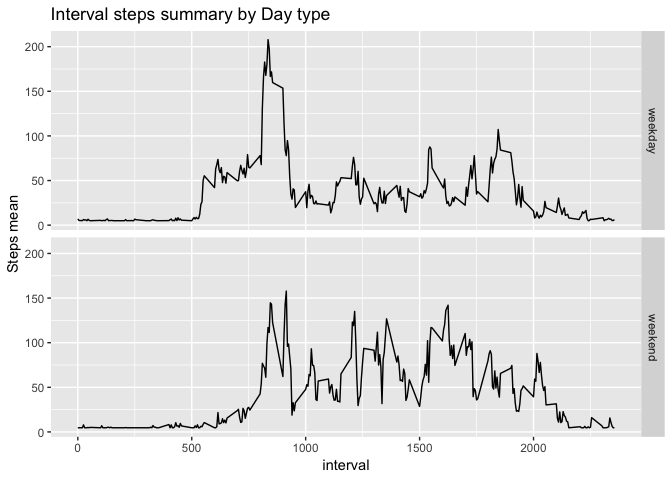

Install used libraries


```r
library(ggplot2)
library(dplyr)
```

```
## 
## Attaching package: 'dplyr'
```

```
## The following objects are masked from 'package:stats':
## 
##     filter, lag
```

```
## The following objects are masked from 'package:base':
## 
##     intersect, setdiff, setequal, union
```


## Loading and preprocessing the data

Unzip the file `activity.zip` and read the activity data


```r
unzip(zipfile = "activity.zip")
activity_df <- read.csv("activity.csv") %>%
               mutate(date = as.Date(date))


str(activity_df)
```

```
## 'data.frame':	17568 obs. of  3 variables:
##  $ steps   : int  NA NA NA NA NA NA NA NA NA NA ...
##  $ date    : Date, format: "2012-10-01" "2012-10-01" ...
##  $ interval: int  0 5 10 15 20 25 30 35 40 45 ...
```


## What is mean total number of steps taken per day?

1. Code for reading in the dataset and/or processing the data

Remove *NA* values. 


```r
activity_filtered <- activity_df %>% 
            filter(!is.na(steps))

str(activity_filtered)
```

```
## 'data.frame':	15264 obs. of  3 variables:
##  $ steps   : int  0 0 0 0 0 0 0 0 0 0 ...
##  $ date    : Date, format: "2012-10-02" "2012-10-02" ...
##  $ interval: int  0 5 10 15 20 25 30 35 40 45 ...
```

2. Histogram of the total number of steps taken each day


```r
ggplot(data=activity_filtered, aes(date)) + geom_histogram() + ggtitle("Total number of steps by day")
```

```
## `stat_bin()` using `bins = 30`. Pick better value with `binwidth`.
```

<!-- -->

3. Mean and median number of steps taken each day


```r
activity_summary <- activity_filtered %>% 
                    group_by(date) %>%
                    summarise(mean = mean(steps), median = median(steps))

activity_summary
```

```
## # A tibble: 53 x 3
##    date         mean median
##    <date>      <dbl>  <dbl>
##  1 2012-10-02  0.438      0
##  2 2012-10-03 39.4        0
##  3 2012-10-04 42.1        0
##  4 2012-10-05 46.2        0
##  5 2012-10-06 53.5        0
##  6 2012-10-07 38.2        0
##  7 2012-10-09 44.5        0
##  8 2012-10-10 34.4        0
##  9 2012-10-11 35.8        0
## 10 2012-10-12 60.4        0
## # … with 43 more rows
```
  

## What is the average daily activity pattern?

1. Time series plot of the average number of steps taken


```r
interval_summary <- activity_filtered %>% 
                    group_by(interval) %>%
                    summarise(mean = mean(steps))

ggplot(data=interval_summary, aes(interval, mean)) + geom_line() + ggtitle("Interval steps summary")
```

<!-- -->

2. The 5-minute interval that, on average, contains the maximum number of steps


```r
interval_summary[max(interval_summary$mean) == interval_summary$mean,1]
```

```
## # A tibble: 1 x 1
##   interval
##      <int>
## 1      835
```

## Imputing missing values

1. Calculate and report the total number of missing values in the dataset


```r
sum(is.na(activity_df$steps))
```

```
## [1] 2304
```

2.Devise a strategy for filling in all of the missing values in the dataset. The strategy does not need to be sophisticated. For example, you could use the mean/median for that day, or the mean for that 5-minute interval, etc.

3.Create a new dataset that is equal to the original dataset but with the missing data filled in.


```r
activity_imputer <- activity_df

activity_imputer <- activity_imputer %>%
  mutate(steps = ifelse(is.na(steps), mean(activity_imputer[activity_imputer$interval == interval,1], na.rm = T), steps) )

str(activity_imputer)
```

```
## 'data.frame':	17568 obs. of  3 variables:
##  $ steps   : num  37.4 37.4 37.4 37.4 37.4 ...
##  $ date    : Date, format: "2012-10-01" "2012-10-01" ...
##  $ interval: int  0 5 10 15 20 25 30 35 40 45 ...
```


4.Make a histogram of the total number of steps taken each day and Calculate and report the mean and median total number of steps taken per day. 

- Histogram of the total number of steps taken each day


```r
ggplot(data=activity_imputer, aes(date)) + geom_histogram() + ggtitle("Total number of steps by day")
```

```
## `stat_bin()` using `bins = 30`. Pick better value with `binwidth`.
```

<!-- -->

- Mean and median number of steps taken each day


```r
activity_summary2 <- activity_imputer %>% 
                    group_by(date) %>%
                    summarise(mean = mean(steps), median = median(steps))

head(activity_summary2)
```

```
## # A tibble: 6 x 3
##   date         mean median
##   <date>      <dbl>  <dbl>
## 1 2012-10-01 37.4     37.4
## 2 2012-10-02  0.438    0  
## 3 2012-10-03 39.4      0  
## 4 2012-10-04 42.1      0  
## 5 2012-10-05 46.2      0  
## 6 2012-10-06 53.5      0
```


#### Do these values differ from the estimates from the first part of the assignment? What is the impact of imputing missing data on the estimates of the total daily number of steps?

Yes, the estimates are different specially on the days that we don't have any record, for the day that has a few NA's the difference is slightly notable 

For the total daily number of steps, we added 2304 new records(13%) this increase particularly the final stats related to the mean of the steps taken

## Are there differences in activity patterns between weekdays and weekends?


```r
activity_imputer_day <- activity_imputer %>%
                    mutate(day = ifelse(weekdays(date) == "Saturday" | weekdays(date) == "Sunday", "weekend", "weekday")) %>%
                    group_by(day, interval) %>%
                    summarise(mean = mean(steps))

head(activity_imputer_day)
```

```
## # A tibble: 6 x 3
## # Groups:   day [1]
##   day     interval  mean
##   <chr>      <int> <dbl>
## 1 weekday        0  7.01
## 2 weekday        5  5.38
## 3 weekday       10  5.14
## 4 weekday       15  5.16
## 5 weekday       20  5.07
## 6 weekday       25  6.30
```


```r
ggplot(data=activity_imputer_day, aes(interval, mean)) + geom_line() + facet_grid(day ~ .) + ggtitle("Interval steps summary by Day type") + ylab("Steps mean")
```

<!-- -->
